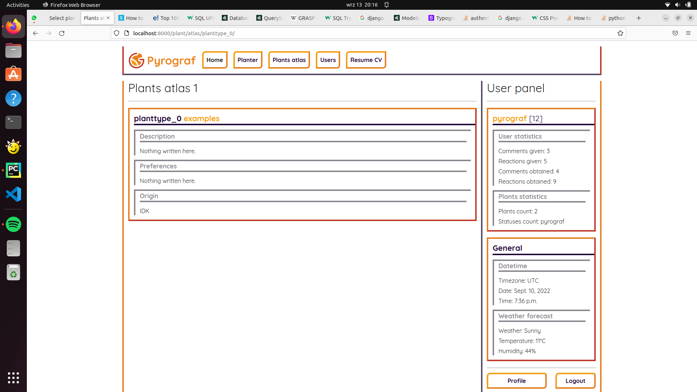

# About
Planter it used to monitor potted plants. It is meant to communicate with IoT devices and present measurements on webpage and through CLI.
Still in development.

## Tools
- PyCharm
- Python
- Django 4.1
- Django REST Framework
- DRF API Key
- Bootstrap 5.0